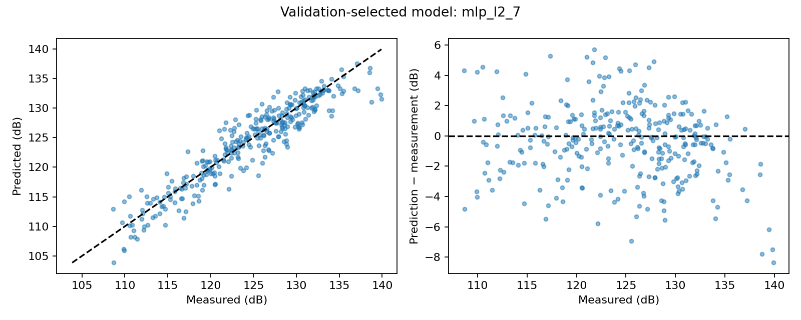
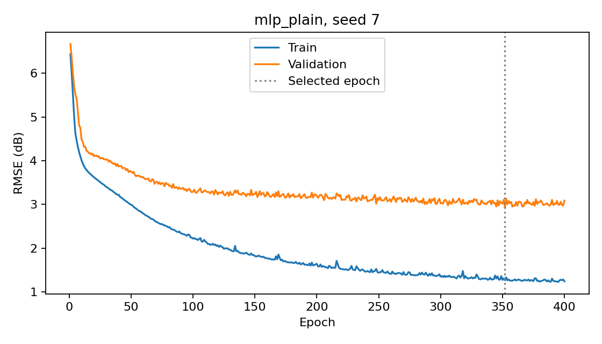
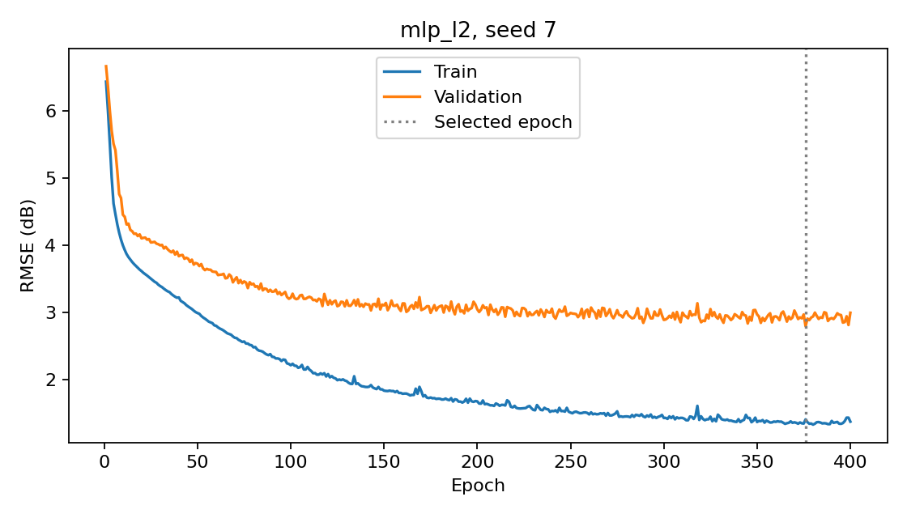

# Predicting airfoil noise with PyTorch

**Shayan Imran Lashari — independent portfolio project**  
**Experiment date:** 15 September 2026  

## Research question

Can a small neural network predict scaled airfoil sound pressure level more accurately than a linear model on held-out aerodynamic condition groups? Does L2 regularisation or reducing the hidden-layer width improve validation performance?

## Data and task

The UCI Airfoil Self-Noise dataset contains 1,503 observations from NASA wind-tunnel tests. Five inputs describe frequency (Hz), angle of attack (degrees), chord length (m), free-stream velocity (m/s), and suction-side displacement thickness (m). The output is scaled sound pressure level in decibels. This is regression: predicting a continuous number rather than a class.

The dataset concerns NACA 0012 airfoils. The model predicts noise at a specified frequency and condition, not an aircraft's total noise. This is an educational aerospace benchmark; no operational Airbus performance is claimed.

Source: Brooks, T., Pope, D., & Marcolini, M. (1989). *Airfoil Self-Noise* [Dataset]. UCI Machine Learning Repository. [Dataset and attribution](https://doi.org/10.24432/C5VW2C). UCI lists the dataset under CC BY 4.0. The supplied raw file was used unchanged.

## Evaluation design

Measurements sharing the same angle, chord, velocity and displacement thickness were assigned to the same group. Frequency was excluded from this grouping, keeping related frequency sweeps together. These are inferred condition groups, not supplied experimental run identifiers. Grouping reduces the risk that closely related rows occur in both training and evaluation, but cannot guarantee complete experimental independence.

| Partition | Rows | Condition groups | Purpose |
|---|---:|---:|---|
| Training | 891 | 63 | Learn weights and fit preprocessing |
| Validation | 291 | 21 | Compare configurations and select checkpoints |
| Test | 321 | 22 | Evaluate the finished choices |

The same split was used for all comparisons, with split seeds 42 and 43. Input and target standardisation used training means and standard deviations only. Predictions were converted back to dB before scoring. This avoids using held-out statistics to fit preprocessing.

## Models and training

The baselines were a training-mean predictor and ordinary linear regression. The neural network was a multilayer perceptron (MLP): 5 inputs, two hidden layers of 32 units with ReLU activations, and one output. It has 1,281 trainable parameters. The smaller comparison used 16 units in each hidden layer, giving 385 parameters.

Both widths were trained with and without L2 regularisation. Training used mean squared error, the Adam optimiser with learning rate 0.001, batches of 64 and 400 epochs. The L2 coefficient was 0.001, compared with 0 for the plain network. Within each width, paired runs shared initialisation seed, batch order and training budget; only regularisation changed.

Each configuration used seeds 7, 17 and 27. The lowest-validation-error checkpoint was restored after each run. Training continued for the full budget to produce diagnostic curves: this was best-checkpoint selection, not early termination.

## Development experiment and decision

The guided experiment reduced hidden-layer width from 32 to 16 while retaining the other settings. A smaller model could potentially generalise better by limiting flexibility, but that benefit was a possibility to investigate, not a guaranteed outcome.

| Units in each hidden layer | Plain MLP validation RMSE (dB) | L2 MLP validation RMSE (dB) |
|---|---:|---:|
| 32 | 2.820 ± 0.093 | 2.698 ± 0.101 |
| 16 | 3.041 ± 0.318 | 3.004 ± 0.169 |

The smaller models remained better than linear regression's validation RMSE of 5.238 dB, but had worse mean validation RMSE than their 32-unit counterparts under this training budget. The 32-unit L2 configuration was therefore retained before evaluating the test data. The experiment does not establish that smaller networks are always worse or that the chosen model is globally optimal.

## Final held-out results

| Model | Test RMSE (dB) | Test MAE (dB) | Test R² |
|---|---:|---:|---:|
| Training-mean predictor | 6.868 | 5.600 | -0.008 |
| Linear regression | 5.087 | 3.946 | 0.447 |
| 32-unit MLP | 2.585 ± 0.110 | 1.959 ± 0.101 | 0.857 ± 0.012 |
| 32-unit MLP with L2 | 2.374 ± 0.111 | 1.789 ± 0.094 | 0.879 ± 0.011 |

Neural-network results are mean ± sample standard deviation across three initialisations on one fixed split. Baselines are deterministic. These deviations describe training variability, not confidence intervals for future data, variation across splits, or individual prediction error bounds.

The validation-selected 32-unit L2 network also had the best mean test scores among the reported configurations. Its mean test RMSE was 53.34% lower than linear regression's: 100 × (5.086871 − 2.373588) / 5.086871. This is a relative reduction in the RMSE metric, not percentage accuracy or physical noise reduction. No test-driven model changes were made in the guided workflow.

MAE summarises absolute error; RMSE gives greater weight to large errors. R² compares squared error with predicting the evaluated partition's own mean. The training-mean baseline has a slightly negative test R² because the training mean differs from the test mean. An R² of 0.879 is not classification accuracy.

## Learning curves and generalisation

For the plain 32-unit model with seed 7, epoch 400 had training RMSE of 1.241 dB and validation RMSE of 3.087 dB. The selected epoch was 352, with validation RMSE of 2.925 dB. For the L2 model with seed 7, the selected epoch was 376, with validation RMSE of 2.795 dB; the final epoch had training RMSE of 1.373 dB and validation RMSE of 2.996 dB.

Both curves improved rapidly at first. Later, training error continued to fall while validation improved slowly and fluctuated. This indicates a generalisation gap and diminishing validation benefit from continued training. The curves mostly levelled off rather than showing sustained severe deterioration, so the evidence should not be exaggerated as dramatic worsening overfitting. The lowest observed validation checkpoint being better than the final epoch also reflects selecting a minimum from a noisy curve.

L2 modestly improved mean validation and test performance in this experiment, while a substantial training–validation gap remained. Three runs on one split do not establish statistical significance or a universal advantage for regularisation.

## Residual analysis

The saved parity and residual plots use the L2 model with seed 7, chosen by a predefined first-seed convention, not by selecting the best test seed. Most predictions track the measured values. Several of the highest measured noise levels, near 140 dB, are underpredicted, with some errors near −8 dB. This is a descriptive observation from the final test plot, not a separately validated subgroup finding.

Residual = prediction − measurement, so negative values mean underprediction. The aggregate RMSE does not guarantee that every error is small. A cause for the high-noise errors has not been established; proposing one would require inspecting the physical inputs and further independent evidence.

Figure 1. Test predictions and residuals for the validation-selected model family, seed 7.

## Limitations and next research step

The study uses a small dataset, one fixed grouped split, a limited airfoil family and a small set of configurations. Different groups may remain correlated. It does not compare against every strong tabular method, quantify predictive uncertainty, or demonstrate reliability on operational aircraft. The observed rankings may change with data splits, optimisation budgets or alternative features.

A future study could compare models using grouped cross-validation on development data, with a new independent evaluation dataset after further tuning. The current test set has now been examined and should not be reused as an untouched selection target.

## Reproducibility and verification

The uploaded archive contains source code, raw data, package versions, saved model weights, preprocessing statistics, split indices, learning histories and predictions for the original, smaller-network and final runs. Final evaluation is already complete: `outputs/final/run.json` records `evaluate_test: true`. The notebook's example path `outputs/my_final` is merely a different destination name, not another evaluation requirement.

Recorded environment: Python 3.13.15, PyTorch 2.11.0+cpu, NumPy 2.1.3 and scikit-learn 1.6.1. The essential dependencies are listed in `requirements.txt`. PyTorch has a compatible version range because wheel availability depends on platform; the recorded run used 2.11.0+cpu. Exact results can differ across environments. The raw data SHA-256 is `74c75fd71783f1e6b71f8a622b993dc592897a97cd689c5090a07147a1b097b3`.

Read-only checks confirmed identical split indices across the three experiments, non-overlapping inferred condition groups, matching data hash, and agreement of all reported test metric means with recalculations from saved predictions. No new training was performed to prepare this report.

To reproduce the final configuration, the original command is `python train.py --evaluate-test --out outputs/final`. It does not need to be run again for this report. For reproduction, `train_smaller.py` contains the 16-unit architecture and matching metadata. It was reconstructed from the final script after the experiments; the learner originally made these changes manually. The original final script remains in `train.py`. The Colab notebook is not required to run these scripts and is not bundled.
